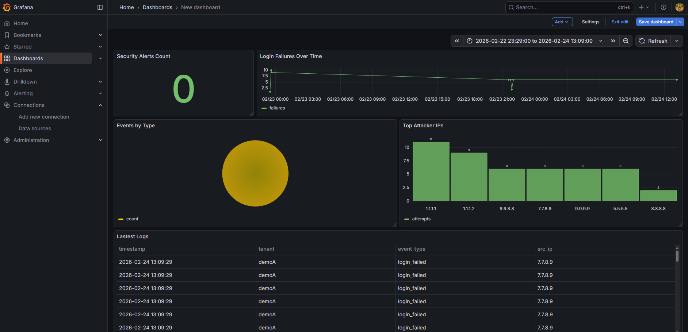
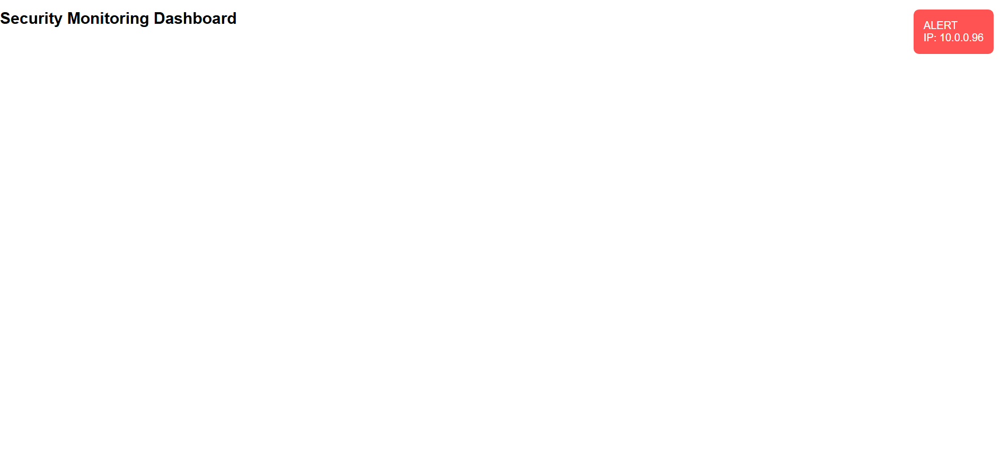

# Log Management & Security Monitoring System
This project simulates a **Security Operations Center (SOC)** workflow including log ingestion, threat detection, and alert monitoring.

---

## Features

### Log Collection
- REST API log ingestion (`/ingest`)
- Syslog UDP listener (port **5140**)
- Supports multi-tenant log input

### Log Processing
- Log normalization & enrichment
- Structured storage in PostgreSQL (JSON raw logs)

### Security Monitoring
- Detect brute-force login attempts
- Real-time alert triggering
- Security alert API endpoint

### Search & Investigation
- Filter logs by tenant & IP
- Recent activity retrieval

### Visualization
- Grafana dashboard integration
- Real-time monitoring & analytics

---

## Tech Stack

### Backend
- Node.js
- Express.js
- Socket.IO (real-time alerts)

### Database
- PostgreSQL

### Monitoring & Visualization
- Grafana

### Infrastructure
- Docker
- Docker Compose

---

## System Architecture

```text
Log Sources
 ├── REST API (/ingest)
 └── Syslog UDP (5140)
      ▼
Node.js Backend
 ├── Log Normalization
 ├── Security Detection
 └── Real-time Alert (Socket.IO)
      ▼
PostgreSQL Database
      ▼
Grafana Dashboard
```

---

## Project Structure

```text
log-management-demo/
├── backend/
│   ├── .env            
│   ├── package.json      
│   └── server.js          
├── frontend/
│   └── alert.html         
└── docker-compose.yml      
```

---

## Setup & Run

### 1️. Start Database & Grafana

```bash
docker compose up -d
```

### 2. Run Backend Server

```bash
cd backend
npm install
node server.js
```
Server runs at: ```http://localhost:3000```

### API Endpoints

#### Ingest Log
POST /ingest
```json
{
  "tenant": "demoA",
  "event_type": "login_failed",
  "ip": "1.1.1.1"
}
```

#### Search Logs

GET ```/logs?tenant=demoA&ip=1.1.1.1```

#### Detect Brute Force Attack

GET ```/alerts/bruteforce```
Returns IPs with ≥5 failed logins within 5 minutes.

### Syslog Listener
Send UDP logs to: ```localhost:5140```
Example:
```bash
echo "Firewall blocked connection" | nc -u localhost 5140
```

### Real-Time Alerts
When multiple login failures are detected:
- Alert is triggered
- Socket.IO emits real-time notification
- Dashboard popup notification (frontend)

### Grafana Dashboard
Open: ```http://localhost:3001```

Default login: ```admin / admin```

Then:
1. Add PostgreSQL data source
2. Connect to the database
3. Create dashboards to visualize logs & security events

### Dashboard Preview



## Real-time Alert



### Security Features
- Brute force detection
- Multi-tenant log isolation
- Role-based access ready
- Real-time alerting
- Centralized log storage

---